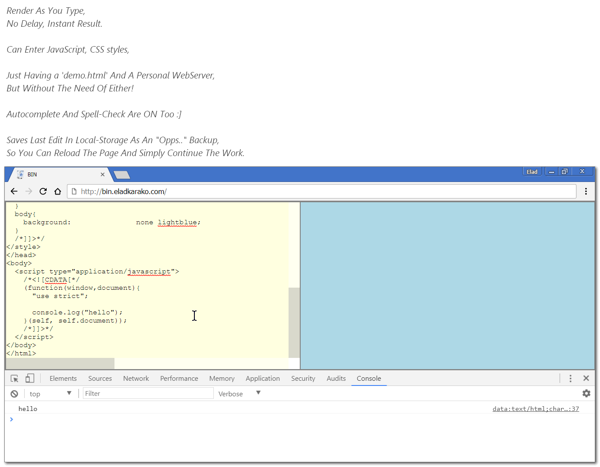

<h1><strong>BIN</strong> &nbsp; </h1>

<h2>BIN is a BinJS' Genius <em>Brother</em>. Better, Faster, <strong>Zero-Loading-Time</strong>.</h2>

<h3>Suggested Usage: Fork It, Add A GitHub-Page- Choose ANY Template And Delete The <code>_config.yml</code>, Browse Your Very-Own <strong>BIN</strong> Using <em>(Replace <code>USERNAME</code> With Your GitHub Username)</em><code>https://USERNAME.github.io/bin.eladkarako.com/</code>.</h3>

